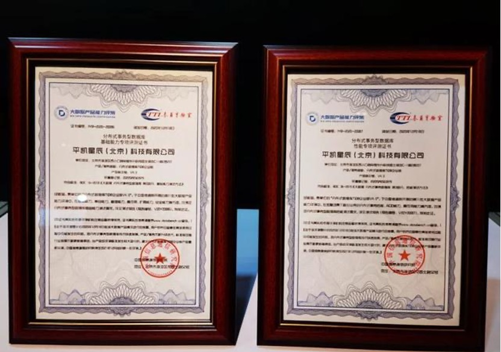

近日，由中国信息通信研究院、中国通信标准化协会、中国互联网协会联合举办的“2020数据资产管理大会”在京召开，会上中国信息通信研究院为通过“大数据产品能力评测”的企业颁发证书。分布式数据库 TiDB 企业版以优异的成绩连续通过分布式数据库性能与基础能力两项权威评测，再次印证了 TiDB 在分布式数据库领域的领先技术优势，特别是在金融核心业务场景下的服务能力。

   
 
大数据时代，信息数据爆炸性增长，几乎所有的企业数据都呈现指数级暴涨，数据库作为基础软件领域的重要基石，是企业全面数字化转型的关键引擎。TiDB 是为企业关键业务打造的开源分布式关系型数据库，具备「分布式强一致性事务、在线弹性水平扩展、故障自恢复的高可用、跨数据中心多活」等企业级核心特性，帮助企业最大化发挥数据价值，充分释放企业增长空间。  

“大数据产品能力评测”是国内首个大数据产品评测体系，已成为大数据行业产品研发和用户选型的重要参考。经过中国信息通信研究院的专业评测，TiDB 分布式数据库在金融场景下核心业务的分布式事务性能、ACID 能力、高可用能力等方面，全部满足分布式事务性数据库性能测试要求。同时，TiDB 在基础能力、兼容能力、管理能力、高可用、扩展能力与安全能力等方面有着明显的优势，均满足分布式事务性数据库基础能力测试要求。 

   

HTAP （Hybrid transaction/analytical processing） 是近年数据库界重点关注的研究方向，TiDB 创新的 HTAP 架构设计打破了在线交易业务与分析业务之间的壁垒，在全面支持关键在线交易业务的同时，让业务数据得以被实时分析和处理，极大提升业务决策和平台构建效率，形成业务全链路闭环。大数据场景下，TiDB 通过 TiFlash 高性能列式分析引擎帮助企业实现多源数据的关联应用，交付多维度、实时、高价值的数据服务，大幅减少数据同步与抽取的开支，增强企业决策的前瞻性和精准性。TiDB 作为通用分布式数据库，已被全球超过 1500 家企业用于线上生产环境，涉及金融、电信、政府、能源、公共事业、高端制造、高科技、新零售、物流、互联网、游戏等多个行业。以金融行业为例，TiDB 已成功在多家头部金融机构成功上线并长期稳定运行，支撑了包括核心总账交易、支付结算、在线贷款、零售理财、风控反欺诈、互联网金融、管理驾驶舱等诸多关键业务系统，全面满足金融行业对数据库稳定性、安全性和性能的高标准要求，成为金融机构数字化转型中 “稳态+敏态” 双轮驱动发展的关键赋能平台。