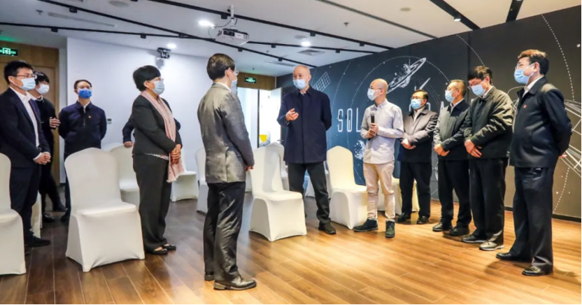

2021 年 3 月，开源正式被列入国家十四五规划发展纲要，可以预期，开源将成为中国未来发展基础软硬件技术的关键路径。3 月 23 日上午，北京市委书记蔡奇一行参观考察平凯星辰（北京）科技有限公司（以下简称“平凯星辰”），专题调研数字经济。平凯星辰创始人兼 CEO 刘奇汇报了平凯星辰在产品研发、技术突破、开源自主创新实践等方面的成果。北京市领导殷勇、张家明，平凯星辰联合创始人兼 CTO 黄东旭、CFO 崔秋参加。  

