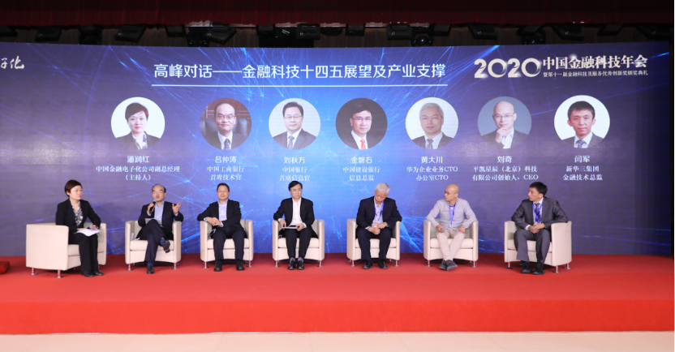
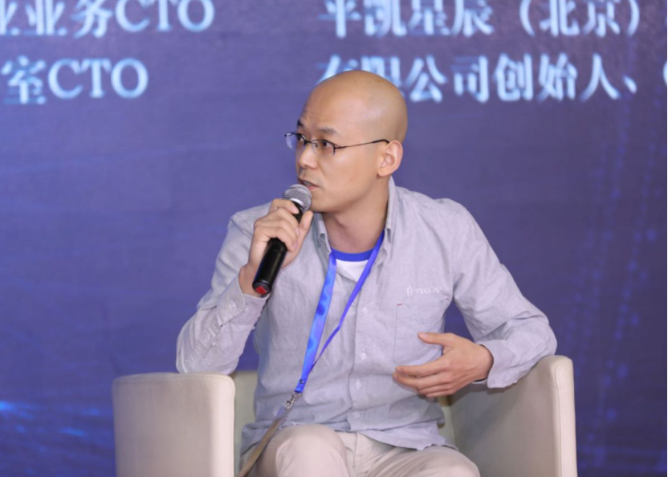

由《金融电子化》杂志社主办的“2020 中国金融科技年会暨第十一届金融科技及服务优秀创新奖颁奖典礼”于 12 月 18 日线上播出。**大会以“奋进新时代 迈向新征程”为主题，作为企业级开源分布式数据库的领导厂商，平凯星辰创始人、CEO 刘奇受邀参与高峰对话**。大会现场表彰了 2020 年度在金融科技领域实践、探索和应用中具有重大突破的优秀解决方案，**TiDB 开源海量分布式数据库在保险核心交易业务的应用解决方案斩获“2020 年度金融科技产品创新突出贡献奖”，充分肯定了平凯星辰在金融科技领域的创新成果与能力。**

 

会上，中国工商银行首席技术官吕仲涛、中国银行首席信息官刘秋万、中国建设银行信息总监金磐石、中国金融电子化公司副总经理潘润红等主要领导与平凯星辰 CEO 刘奇先生一起进行了高峰对话及金融科技领域的洞察分享与探讨。  

刘奇表示，“平凯星辰作为一家专注在分布式数据库基础软件领域开拓的科技企业，在中国经济迈入“十四五”时期和金融科技加速布局建设的今天，我们深感责任重大。在过去几年里，我们投入整个公司和团队的资源，**全力打磨核心产品 TiDB 分布式数据库，在帮助金融企业打通数据融合通道，协助建立云数据处理能力，支持与保障更加安全稳定可控的数据库服务方向上**全力以赴的进行产研与落地工作，取得了一定的成绩。央行发布的金融科技发展规划对我们的奋斗目标提出了进一步的要求，从“十三五” 到“十四五” 阶段，我们通过总结经验与实践反思，深感唯有聚焦与全力以赴的投入才能在未来，在基础软件层面帮助到更多的金融科技企业及他们正在进行中的数字化转型建设工作。同时利用我们的开源开放与联合创新的基因，在这个方向上打造可持续发展的、面向未来的基础软件生态体系和人才体系。”  

成立至今，平凯星辰一直积极参与金融行业及金融科技企业的发展创新工作，过去 2 年参与了部分金融机构与金融科技企业在**普惠金融、在线支付、信贷管理、风险管控**等方面的建设，通过现代化的技术手段和一些长期打磨的核心能力帮助用户**提高金融服务中的数据处理能力和对外金融服务效率**。 全面满足金融行业对数据库稳定性、安全性和性能的高标准要求，成为金融机构数字化转型中 “稳态+敏态” 双轮驱动发展的关键赋能平台。  

 
刘奇，平凯星辰创始人、CEO
  

在积累服务经验的同时，公司也在深入思考和探索面向未来的金融服务场景，如何将技术架构带来的先进性与业务场景更深度的融合，将整个团队**在产品技术方向上的持续专注投入转化为提升金融行业用户生产力**。对此，刘奇表示，将继续持续加大在打造金融级分布式数据库方面的投入，**坚持聚焦，坚持开放，坚持生态体系建设与联合创新开拓**，抓住中国经济发展与金融科技演进的机遇，脚踏实地的服务好更多的金融科技用户。  

**同时，作为开源分布式数据库的领导厂商，TiDB 开源海量分布式数据库在保险核心交易业务的应用解决方案斩获“2020 年度金融科技产品创新突出贡献奖”**。 这套解决方案成功将中国人寿财险旗下的国寿天财非车险、电子投保等核心业务场景迁移至 TiDB 集群中，为非车险及电子投保系统的客户身份认证、投保、对接银行保单处理、电子发票开具等业务提供高效稳定的数据库服务，同时提供了异构数据库的灾备能力，实现了 RPO=0、RTO <30 秒的金融生产级运行的保障要求。该项目是国内大型产险公司第一批采用 NewSQL 架构的国产分布式数据库案例，这对于当前在金融行业实现数字化转型，解决金融企业高并发，大吞吐量的关键业务运行和发展提供了一份具有高度可参考性的建设实践参考样本。在此也由衷的感谢中国人寿财险对 TiDB 的信任和支持。  

平凯星辰成立于 2015 年，是一家企业级开源分布式数据库厂商，提供包括开源分布式数据库产品、解决方案与咨询、技术支持与培训认证服务，致力于为全球行业用户提供稳定高效、安全可靠、开放兼容的新型数据基础设施，解放企业生产力，加速企业数字化转型升级。由平凯星辰创立的分布式关系型数据库 TiDB，为企业关键业务打造，具备「分布式强一致性事务、在线弹性水平扩展、故障自恢复的高可用、跨数据中心多活」等企业级核心特性，帮助企业最大化发挥数据价值，充分释放企业增长空间。  

截止目前，TiDB 已被全球超过 1500 家企业用于线上生产环境，包括中国、美国、欧洲、日本、东南亚等国家和地区，涉及金融、运营商、制造、零售、互联网、政府等多个行业。
