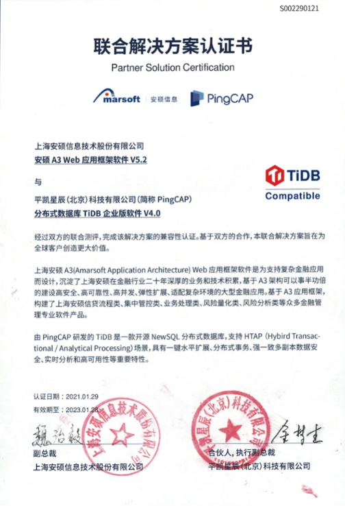

上海安硕 A3（Amarsoft Application Architecture）Web 应用框架软件为支持复杂金融应用而设计，沉淀了上海安硕在金融行业二十年深厚的业务和技术积累，基于 A3 架构可以事半功倍的建设高安全、高可靠性、高并发、弹性扩展、适配复杂环境的大型金融应用。基于 A3 应用框架，构建了上海安硕信贷流程类、集中管控类、业务处理类、风险量化类、风险分析类等众多金融管理专业软件产品。TiDB 开创性的使用新一代分布式处理技术，具有数据强一致、高可用、高性能、在线扩展、高度兼容 SQL 标准和主流关系数据库、低成本等特点和优势，作为安硕 A3 应用框架软件下的数据库平台，整体方案满足弹性扩展、稳定性强等要求，TiDB 透明可扩展 HTAP 能力为信贷类、集中管控类、以及风险分析类业务提供了实时风控的应用基础。

 

双方基于 TiDB 与安硕 A3 应用框架，构建了信贷流程、集中管控、业务处理、风险量化、风险分析众多金融管理专业软件产品的基础，满足金融客户内部业务系统对数据库成熟稳定、高可用、多中心部署的技术要求。

平凯星辰（北京）科技有限公司积极参与国产化生态建设，TiDB 是领先的国产分布式数据库产品。公司 2015 年成立就专注新一代开源分布式数据库技术研发，致力于打造数据库基础软件的供应链安全，建设成熟的生态社区、提供可靠的企业级专业服务团队。为企业客户提供稳定高效、安全可靠、开放兼容的新型数据基础设施，解放企业生产力、加速企业数字化转型升级。产品被超过 1500 家客户用于线上生产环境，包括中国银行、光大银行、北京银行、浙商银行、中国人寿、平安保险、中信建投、广发证券、安信证券、国信证券、陆金所、中国移动、中国电信等重要商业客户。

上海安硕信息技术股份有限公司（简称“安硕信息”，股票代码 300380）自成立至今一直专业从事信用风险管理领域的业务咨询、IT 系统实施和内容服务，作为国内银行业信用风险管理系统领域的主要解决方案供应商之一，多年来一直在该领域保持较高的市场占有率。

安硕信息拥有系列化的信贷管理系统、风险管理系统、信托管理系统、互联网金融解决方案、供应链融资系统等自主可控的软件产品，多年来持续为各类金融及非金融客户提供业务咨询、系统开发与实施、数据服务等服务，包括国有商业银行、股份制商业银行、外资银行、城商行、农商行、农信社、信托公司、保险公司、证券公司、互联网。
