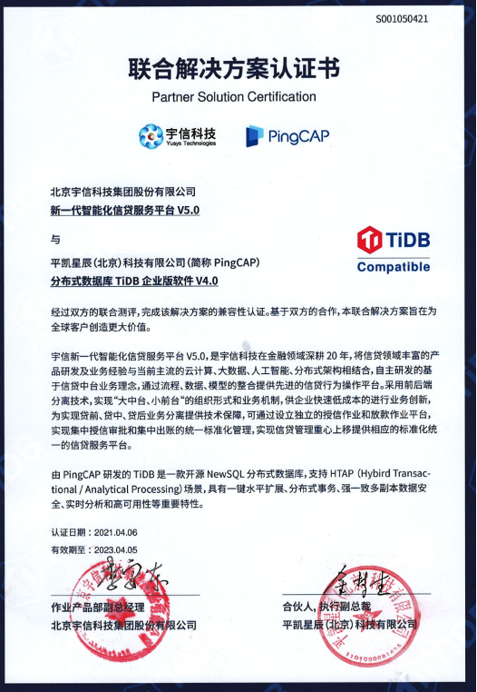

宇信新一代智能化信贷服务平台 V5.0，是宇信科技在金融领域深耕 20 年，结合信贷领域丰富的产品研发及业务经验，自主研发的基于信贷中台业务理念，通过流程、数据、模型的整合提供先进的信贷行为操作平台。采用前后端分离技术，实现“大中台、小前台" 的组织形式和业务机制，供企业快速低成本的进行业务创新，为实现贷前、贷中、贷后业务分离提供技术保障。可通过设立独立的授信作业和放款作业平台，实现集中授信审批和集中出账的统一标准化管理，实现信贷管理重心上移提供相应的标准化统一的信贷服务平台。作为宇信信贷管理系统的数据库平台，TiDB 整体方案可满足弹性扩展、稳定性强等要求，透明可扩展的 HTAP 能力为网贷及互联网端业务的接入、实时风控提供了应用基础。

 

双方基于 TiDB 与宇信科技新一代智能化信贷服务平台 V5.0 的联合解决方案，满足了金融行业客户对于信贷业务的操作需求，同时支持敏态的网贷系统、批量核算系统。敏捷扩缩容、对应用透明、无需分库分表、简化应用开发、高可用多中心部署等特性为银行关键业务系统保驾护航。

平凯星辰（北京）科技有限公司积极参与国产化生态建设，TiDB 是领先的国产分布式数据库产品。公司 2015 年成立就专注新一代开源分布式数据库技术研发，致力于打造数据库基础软件的供应链安全，建设成熟的生态社区、提供可靠的企业级专业服务团队。为企业客户提供稳定高效、安全可靠、开放兼容的新型数据基础设施，解放企业生产力、加速企业数字化转型升级。产品被超过 1500 家客户用于线上生产环境，包括中国银行、光大银行、北京银行、浙商银行、中国人寿、平安保险、中信建投、广发证券、安信证券、国信证券、陆金所、中国移动、中国电信等重要商业客户。

宇信科技是全面领先的金融科技赋能者，为金融机构提供 IT 咨询规划、软件产品、解决方案和实施、运维与测试、系统集成、业务运营等形态丰富的金融科技服务和产品，全面满足客户数字化转型的不同需要。自 2010 年起，公司连续多年在中国银行 IT 解决方案市场排名领先，始终保持在信贷操作、商业智能、网络银行、渠道管理、渠道合规等多个细分领域的领先地位。
