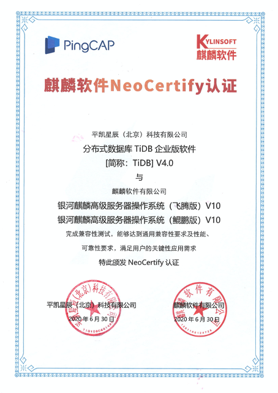

平凯星辰（北京）科技有限公司与麒麟软件有限公司完成产品互认证工作，经过双方共同严格测试，分布式数据库 TiDB 企业版软件 4.0 在银河麒麟高级服务器操作系统（飞腾、鲲鹏）版本 V10 上顺利安装部署，运行稳定、安全可靠、相互兼容，可为企业级用户提供全面信息安全保障。 

 

TiDB 是平凯星辰（北京）科技有限公司自主设计、研发的开源分布式关系型数据库，是一款同时支持在线事务处理与在线分析处理（Hybrid Transactional and Analytical Processing, HTAP）的融合型分布式数据库产品，具备水平扩容或者缩容、金融级高可用、实时 HTAP、云原生的分布式数据库，兼容 MySQL5.7 协议和 MySQL 生态等重要特性。为用户提供一站式 OLTP(Online Transactional Processing)、OLAP(Online Analytical Processing)、HTAP 解决方案。适用于高可靠、强一致、大数量在线核心交易与实时分析等应用场景。

银河麒麟高级服务器操作系统 V10 是针对企业级关键业务，适应虚拟化、云计算、大数据、工业互联网时代对主机系统可靠性、安全性、性能、扩展性和实时性的需求，依据 CMMI 5 级标准研制的提供内生安全、云原生支持、国产平台深入优化、高性能、易管理的新一代自主服务器操作系统；同源支持飞腾、龙芯、申威、兆芯、海光、鲲鹏等自主 CPU 及 x86 平台；可支撑构建大型数据中心服务器高可用集群、负载均衡集群、分布式集群文件系统、虚拟化应用和容器云平台等，可部署在物理服务器和虚拟化环境、私有云、公有云和混合云环境；应用于政府、国防、金融、教育、财税、公安、审计、交通、医疗、制造等领域。

双方兼容认证与合作持续地拓展了基础软件生态合作伙伴的范围，发挥各自在技术领域的优势，帮助更多行业企业客户实现基础软件的国产化。推进国产基础软件的自主化和标准化步伐，培育国内基础软件生态圈人才队伍。

平凯星辰（北京）科技有限公司积极参与国产化生态建设，TiDB 是领先的国产分布式数据库产品。公司 2015 年成立就专注新一代开源分布式数据库技术研发，致力于打造数据库基础软件的供应链安全，建设成熟的生态社区、提供可靠的企业级专业服务团队。为企业客户提供稳定高效、安全可靠、开放兼容的新型数据基础设施，解放企业生产力、加速企业数字化转型升级。产品被超过 1500 家客户用于线上生产环境，包括中国银行、光大银行、北京银行、浙商银行、中国人寿、平安保险、中信建投、广发证券、安信证券、国信证券、陆金所、中国移动、中国电信等重要商业客户。

麒麟软件以安全可信操作系统技术为核心，旗下拥有“银河麒麟”、“中标麒麟”两大产品品牌，面向通用和专用领域打造安全创新操作系统产品和相应解决方案，现已形成了服务器操作系统、桌面操作系统、嵌入式操作系统、麒麟云、安全邮件等产品。麒麟软件系列产品能同时支持飞腾、鲲鹏、龙芯、申威、海光、兆芯等国产 CPU。企业坚持开放合作共建产业生态，为客户提供完整的国产化解决方案。

