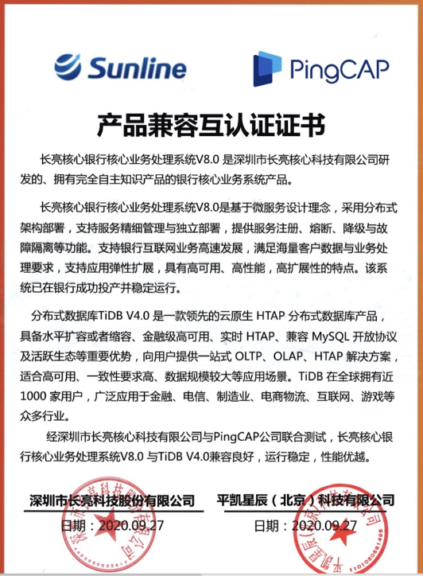

平凯星辰（北京）科技有限公司与深圳长亮科技股份有限公司完成产品互认证工作，经过双方共同严格功能以及性能测试，分布式数据库 TiDB 企业版软件 4.0 与长亮核心银行核心业务处理系统 V8.0 产品相互兼容，整体运行稳定高效、性能优越，可为金融企业级核心应用提供全面保障。

 

TiDB 是平凯星辰（北京）科技有限公司自主设计、研发的开源分布式关系型数据库，是一款同时支持在线事务处理与在线分析处理（Hybrid Transactional and Analytical Processing,HTAP）的融合型分布式数据库产品，具备水平扩容或者缩容、金融级高可用、实时 HTAP、云原生的分布式数据库，兼容 MySQL5.7 协议和 MySQL 生态等重要特性。为用户提供一站式 OLTP(Online Transactional Processing)、OLAP(Online Analytical Processing)、HTAP 解决方案。适用于高可靠、强一致、大数量在线核心交易与实时分析等应用场景。

长亮核心银行核心业务处理系统 V8.0 是基于微服务设计理念，采用分布式架构部署，支持服务精细管理与独立部署，提供服务注册、熔断、降级与故障隔离等功能。支持银行互联网业务高速发展，满足海量客户数据与业务处理要求，支持应用弹性扩展，具有高可用、高性能、高扩展性的特点。该系统已在银行成功投产并稳定运行。

基于分布式数据库 TiDB 企业版软件 4.0 构建银行核心业务，从根本保障金融用户信息安全，掌握未来发展和竞争的主动权。同时推动金融行业在业务上的创新，IT 基础架构向云化、数据中台化的升级，加速数字化转型进程。

平凯星辰（北京）科技有限公司积极参与国产化生态建设、TiDB 是领先的国产分布式数据库产品。公司 2015 年成立就专注新一代开源分布式数据库技术研发，致力于打造数据库基础软件的供应链安全，建设成熟的生态社区、提供可靠的企业级专业服务团队。为企业客户提供稳定高效、安全可靠、开放兼容的新型数据基础设施，解放企业生产力、加速企业数字化转型升级。产品被超过 1500 家客户用于线上生产环境，包括中国银行、光大银行、北京银行、浙商银行、中国人寿、平安保险、中信建投、广发证券、安信证券、国信证券、陆金所、中国移动、中国电信等重要商业客户。

长亮科技是全球领先的金融 IT 解决方案供应商，为金融机构提供核心业务、互联网金融业务、数据业务和管理业务等整体化金融 IT 解决方案。凭借超强自主创新能力、灵活的定制能力和完善的交付及售后服务能力，为全球逾 800 家客户提供具有互联网思维的整体化智能金融 IT 解决方案。助力传统银行搭载互联网金融架构实现转型升级，满足客户的多并发需求，抓住转型新机遇；助力金融机构逐浪互联网大潮，抢占经济制高点。

