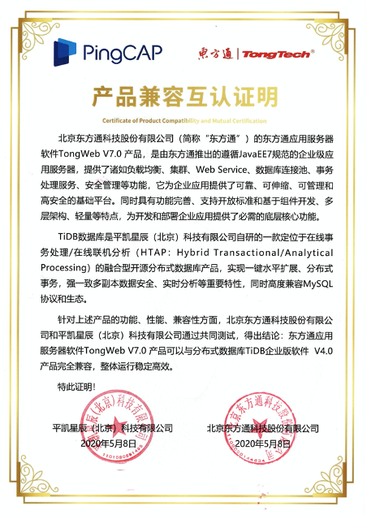

平凯星辰（北京）科技有限公司与北京东方通科技股份有限公司完成产品互认证工作，经过双方共同严格测试，分布式数据库 TiDB 企业版软件 4.0 与东方通应用服务器软件 TongWeb V7.0 产品相互兼容，整体运行稳定高效、性能优越，可为企业级应用提供全面保障。 

 

TiDB 是平凯星辰（北京）科技有限公司自主设计、研发的开源分布式关系型数据库，是一款同时支持在线事务处理与在线分析处理（Hybrid Transactional and Analytical Processing, HTAP）的融合型分布式数据库产品，具备水平扩容或者缩容、金融级高可用、实时 HTAP、云原生的分布式数据库，兼容 MySQL5.7 协议和 MySQL 生态等重要特性。为用户提供一站式 OLTP(Online Transactional Processing)、OLAP(Online Analytical Processing)、HTAP 解决方案，适用于高可靠、强一致、大数量在线核心交易与实时分析等应用场景。

东方通应用服务器软件 TongWeb V7.0 产品，是由东方通推出的遵循 JavaEE 7 规范的企业级应用服务器，提供了诸如负载均衡、集群、Web Service、数据库连接池、事务处理服务、安全管理等功能，为企业应用提供了可靠、可伸缩、可管理和高安全的基础平台。同时具有功能完善、支持开放标准和基于组件开发、多层架构、轻量等特点，为开发和部署企业应用提供了必需的底层核心功能。

双方兼容认证与合作持续地拓展了基础软件生态合作伙伴的范围，发挥各自在技术领域的优势，帮助更多行业企业客户实现基础软件的国产化，推进国产基础软件的自主化和标准化步伐。

平凯星辰（北京）科技有限公司积极参与国产化生态建设、TiDB 是领先的国产分布式数据库产品。公司 2015 年成立就专注新一代开源分布式数据库技术研发，致力于打造数据库基础软件的供应链安全，建设成熟的生态社区、提供可靠的企业级专业服务团队。为企业客户提供稳定高效、安全可靠、开放兼容的新型数据基础设施，解放企业生产力、加速企业数字化转型升级。产品被超过 1500 家客户用于线上生产环境，包括中国银行、光大银行、北京银行、浙商银行、中国人寿、平安保险、中信建投、广发证券、安信证券、国信证券、陆金所、中国移动、中国电信等重要商业客户。

东方通（股票代码：300379），是国内 A 股上市的基础软件厂商，以 “安全+” 和 “数据+” 两大产品体系为基础，为客户提供综合解决方案及服务，是国内领先的大安全及行业信息化产品、解决方案提供商。东方通的产品及解决方案广泛应用于国内数千个行业业务，服务电信、金融、政府、能源、交通等行业领域 5000 多家企业级用户，与 2000 多家合作伙伴携手打造合作共赢的产业生态。东方通连续十二年被认定为“国家规划布局内重点软件企业”，承担多项国家重大科技专项的研制任务，是 2018 年北京软件和信息服务业综合实力百强企业，是商务部、国资委认证的“企业信用评价 AAA 级信用企业”，曾荣获“国家科技进步二等奖”、北京市科学技术进步奖二等奖等多项荣誉。
