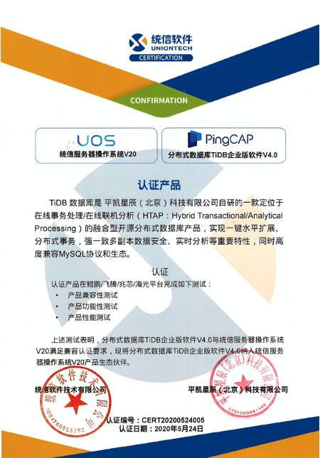

分布式数据库 TiDB 企业版软件 4.0 与统信服务器操作系统 V20 完成兼容性适配工作。经过双方严格测试，双方产品相互兼容，可顺利安装并稳定运行，整体能够满足用户应用需求，为行业用户提供安全稳定、易用的操作系统与开源数据库产品解决方案的同时，加速构建我国基础软硬件生态，更高效的服务于更多有需求的客户。

 

TiDB 是平凯星辰（北京）科技有限公司自主设计、研发的开源分布式关系型数据库，是一款同时支持在线事务处理与在线分析处理（Hybrid Transactional and Analytical Processing ,HTAP）的融合型分布式数据库产品，具备水平扩容或者缩容、金融级高可用、实时HTAP、云原生的分布式数据库，兼容 MySQL5.7 协议和 MySQL 生态等重要特性。为用户提供一站式 OLTP(Online Transactional Processing)、OLAP(Online Analytical Processing)、HTAP 解决方案。适用于高可靠、强一致、大数量在线核心交易与实时分析等应用场景。

统信服务器操作系统 V20 针对企业级关键业务及数据负载而构建，适应典型服务器场景、云和容器、大数据、人工智能、工业互联网时代对主机系统可靠性、安全性、性能、扩展性和实时性的需求。

双方兼容认证与合作持续地拓展了基础软件生态合作伙伴的范围，发挥各自在技术领域的优势，帮助更多行业企业客户实现基础软件的国产化。推进国产基础软件的自主化和标准化步伐，培育国内基础软件生态圈人才队伍的建设。

平凯星辰（北京）科技有限公司积极参与国产化生态建设，公司 2015 年成立就专注新一代开源分布式数据库 TiDB 的技术研发，致力于打造数据库基础软件的供应链安全，建设成熟的生态社区、提供可靠的企业级专业服务团队。为企业客户提供稳定高效、安全可靠、开放兼容的新型数据基础设施，解放企业生产力、加速企业数字化转型升级。TiDB 已被超过1500客户用于线上生产环境，包括中国银行、光大银行、北京银行、浙商银行、中国人寿、平安保险、中信建投、广发证券、安信证券、国信证券、陆金所、中国移动、中国电信等重要商业客户。

统信软件技术有限公司（简称：统信软件）成立于 2019 年，总部设立在北京，同时在武汉、上海、广州、南京、成都、重庆、西安、太原、深圳等地设立了地方技术支持机构、研发中心和通用软硬件适配中心。作为以技术创新为基因的高科技企业，统信软件在操作系统研发、行业定制、国际化、迁移适配、交互设计等多方面拥有深厚的技术积淀，能够满足不同用户和应用场景对操作系统产品的广泛需求，可为政企行业信息化、数字经济建设提供坚实可信的基础支撑，重塑信息产业发展底座。
