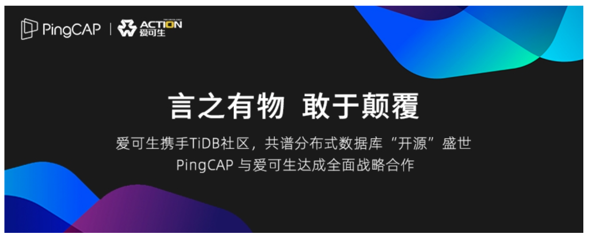
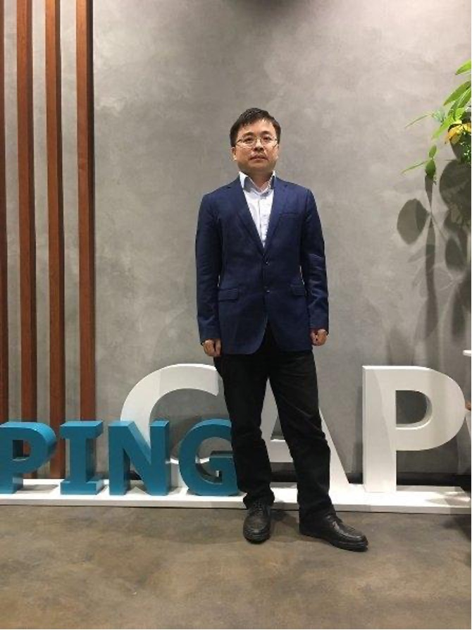

近日，平凯星辰（北京）科技有限公司（以下简称平凯星辰）与上海爱可生信息技术股份有限公司（以下简称爱可生）正式宣布展开战略合作，爱可生将投入从产品研发到服务支撑的全面资源加入 TiDB 生态体系，携手平凯星辰成为 TiDB 社区的重要参与伙伴。双方合作的重点方向是将 TiDB 的高并发海量数据实时 HTAP 分布式架构与爱可生在开源数据库领域针对企业级数据库管理体系的解决方案相结合，共同打造基于 TiDB 的数据库管理平台产品和企业级服务支撑能力体系。 

 

平凯星辰是一家开源的新型分布式数据库公司，秉承开源是基础软件的未来这一理念，持续扩大社区影响力，致力于前沿技术领域的创新实现。其研发的分布式关系型数据库产品 TiDB，具备「分布式强一致性事务、在线弹性水平扩展、故障自恢复的高可用、跨数据中心多活」等核心特性，是大数据时代理想的数据库集群和云原生数据库解决方案。目前已经有超过 1000 家用户将 TiDB 用于线上生产环境，涉及互联网、游戏、银行、保险、证券、航空、制造业、电信、新零售、政府等多个行业，包括美国、欧洲、日本、东南亚等海外用户。  

爱可生是国内 MySQL 等开源数据库整体解决方案提供商，经过 10 余年在开源数据库与私有云落地的沉淀，以及在金融级数据库管理的核心技术创新，公司已有 50 余项云树系列数据库管理软件产品著作权和核心发明专利技术，并拥有体系化的数据库一站式服务能力。解决方案已经服务于 400 家大型企业，其中包括工商银行、招商银行、兴业银行、中国人寿、中国太保、中国平安、国家电网、上汽集团、中国移动、中国电信等 30 家世界 500 强企业。

云树 DMP（数据库集群管理平台）产品以开源数据库作为存储节点，解决高可用、分布式、大体量运维管理、云化等核心数据库管理问题，满足了金融的开发和运维体系和管理基线等相关要求，形成了完整的开源数据库全生态整体解决方案。技术优势是高可用、大体量、高安全、智能化，可以适应众多上线的金融 A+ 类核心业务的高可用保障、多中心部署满足银行体系灾备 5 级以上要求、单管理平台可以管理跨数据中心的 5000 个以上的数据库实例以及平台具备众多的自动巡检、故障自愈等智能化的数据库管理能力。

此次平凯星辰与爱可生的战略合作，双方主要致力于在以下领域合作创新：

- 爱可生将实现其云树 DMP 管理平台产品对 TiDB 多集群可视化管理的全面支持；
- 双方建立联合技术中心，共同研究和推广 TiDB 在智能运维管理、私有云建设、多中心容灾等领域的解决方案，并面向商业客户提供整体打通的企业级数据库服务；
- 爱可生成为平凯星辰 TiDB 企业版产品中国区增值分销商（VAD）。

同时，爱可生将进入 TiDB 开发社区成为 TiDB 社区企业级贡献者。双方计划将双方技术生态社区进行更好的资源联结与协作，为用户提供更丰富的、可持续发展的产品生态而共同努力。此外，双方也将在人才联合培养、市场资源优势互补、国际业务拓展等方面展开广泛的合作。

平凯星辰合伙人兼执行副总裁余梦杰在 TiDB DevCon 2020 的伙伴生态合作分享中指出，“TiDB 步入生态蓬勃发展的快车道，迎接挑战的同时，更关键的聚焦是立足在 2020 并展望未来的历史机遇，而与伙伴的精诚合作是其中非常重要的一环；和爱可生的战略合作及未来更多领域伙伴的合作，将是我们立足开源精神、放眼世界打造国人自主新旗帜的基石。”  

 

爱可生 CEO 李恒在本次 DevCon 会议上也分享，“作为 NewSQL 分布式数据库的代表产品，非常看好 TiDB 在 HTAP 领域为各行业应用带来的创新体验。同时，TiDB 开发的生态体系也为像爱可生这样的数据库解决方案厂商带来的全新的市场空间。此次平凯星辰与爱可生的战略合作，源于爱可生在数据库管理平台领域的深厚技术积累以及金融级数据库解决方案的丰富落地。在数据库领域，除了数据库内核能力，管理平台和体系化管理服务对于数据库的大规模使用至关重要。TiDB 是优秀的分布式数据库产品，爱可生将致力于把这样优秀的开源数据库内核纳入到我们的数据库管理产品能力和服务范畴。未来爱可生将提供面向私有云的更多数据库的管理平台产品和服务能力，更好地帮客户解决数据库国产化替代当中的实际问题。”
