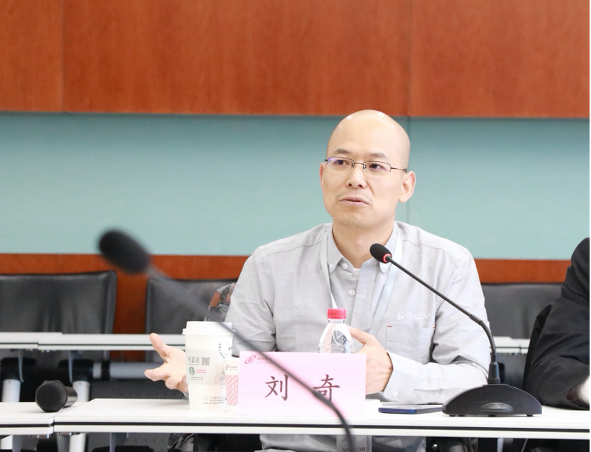

神州数码集团股份有限公司（以下简称：神州数码）与平凯星辰（北京）科技有限公司（以下简称：平凯星辰）在京举办战略合作签约仪式，宣布双方将基于全球新一代关系型数据库（NewSQL）开源项目 TiDB，打造神州数码自有品牌分布式数据库一体机，并展开联合产品、联合营销、联合生态等多维度的战略合作，以开源技术构筑数新基建底座，赋能企业数字化转型和产业高质量发展。

神州数码集团常务副总裁叶海强、CTO 周鹏、CIO 沈旸、企业软件应用 SBU 常务副总经理李新、平凯星辰创始人兼 CEO 刘奇、联合创始人兼 CTO 黄东旭、企业及合作伙伴事业部总经理樊殊昱共同出席并见证。

 

## 开源引领数字未来，数据构筑新基石

数字时代，开源技术正在引领整个信息技术产业的发展。云和开源技术正加速与 IT 基础设施的融合重构，成为企业数字化转型的催化剂。而面对指数级增长的海量数据处理需求，数据库作为基础软件领域的基石和企业数字化转型的关键引擎，也开始在云化赛道上加速延展。据 Gartner 预测，到 2022 年将有 75% 的数据库将被部署或迁移到云上。

作为开源分布式数据库的领导企业，平凯星辰始终致力于前沿技术领域的创新与实践，其创立的企业级分布式关系型数据库 TiDB，已成为大数据时代理想的数据库集群和云数据库解决方案。目前，TiDB 已被 1500 余家企业应用在生产环境，涉及互联网、游戏、银行、保险、证券、航空、制造业、电信、新零售、政府等多个行业，以及美国、欧洲、日本、南亚等国家和区域。

  

平凯星辰联合创始人、CTO 黄东旭
  

平凯星辰联合创始人、CTO 黄东旭表示，神州数码一直是 TiDB 技术社区中的活跃成员，在技术架构原理与行业前瞻应用方面都有很深入的理解，此次一体机产品就是神州数码与平凯星辰在数据库技术领域联合创新的成果体现。

  
 
神州数码集团 CIO 沈旸

神州数码集团 CIO 沈旸表示，TiDB 已成为全球基础软件领域的知名开源项目。神州数码也是 TiDB 的早期应用者之一，我们不仅在自身的数字化应用场景中采用 TiDB，率先在 ARM 平台上适配 TiDB 并用于生产环境，也将 TiDB 的应用扩展到异构的计算体系下，能同时在 ARM 和 X86 跨平台运行 TiDB 分布式数据库，实现数据在不同计算架构平台的打通。接下来，神州数码也将加入 TiDB 社区并组建技术团队，与平凯星辰一道打造更为开放的社区生态，拓展和积累更具挑战的业务场景，并持续不断打磨方案和产品，为行业企业的数字化转型提供更专业的产品和更优质的技术方案服务。

## 产品+营销+生态，强强联合，携手助力新基建
作为多年来始终坚持用技术赋能产业发展的科技企业，近年来，随着云原生和开源技术的持续发展，加快探索和应用开源技术，推动云及自主创新双轮发展，也成为神州数码的重要布局之一。

以此次战略合作为契机，神州数码将与平凯星辰携手成立联合产品中心，基于 TiDB 和神州鲲泰服务器打造自有品牌新一代分布式数据库一体机产品，并形成端到端的技术解决方案交付，整体推向市场。同时，双方还将通过联合营销中心，推动 TiDB 和神州数码分布式数据库一体机产品在金融、政府等行业的方案整合和落地。在此基础上，双方还将成立联合生态中心，基于神州数码发起成立的“数字中国服务联盟”，在产品集中采购、服务能力输出、品牌合作授权等方面展开积极探索并打造一体化整体解决方案，展开更多创新合作模式和前沿领域的前瞻性探索。
 
  

神州数码集团常务副总裁  叶海强

神州数码集团常务副总裁叶海强表示，面向 2035，“新基建”将成为中国经济发展的重要基点。在这个开源的黄金时代，与平凯星辰的战略合作，是神州数码在开源技术和自有品牌产品两个维度上的重要落子，我们希望通过双方的紧密合作，充分发挥各自优势，推动和引领面向未来的信息化基础设施的变革和迭代，并且在这个过程中，探索和挖掘更具价值的合作模式。

   

平凯星辰创始人兼 CEO 刘奇

平凯星辰创始人兼 CEO 刘奇表示，作为国内主要的云及数字化服务商，神州数码一直以来具备深厚的技术实力、丰富的解决方案和强大的数字生态。作为云原生开源基础软件的创新者，平凯星辰与神州数码的战略合作将在数据基础设施领域强强联手，不断提升技术创新能力与核心服务能力，帮助行业用户更好地拥抱数字时代。

开源技术的普及，让今天的数字化转型驶入新的加速创新的赛道。面向未来，践行“数字中国”，神州数码将与平凯星辰以及更多生态伙伴，夯实能力，携手并进，不断推动开源技术的普适化应用，引领数字经济持续健康发展。
