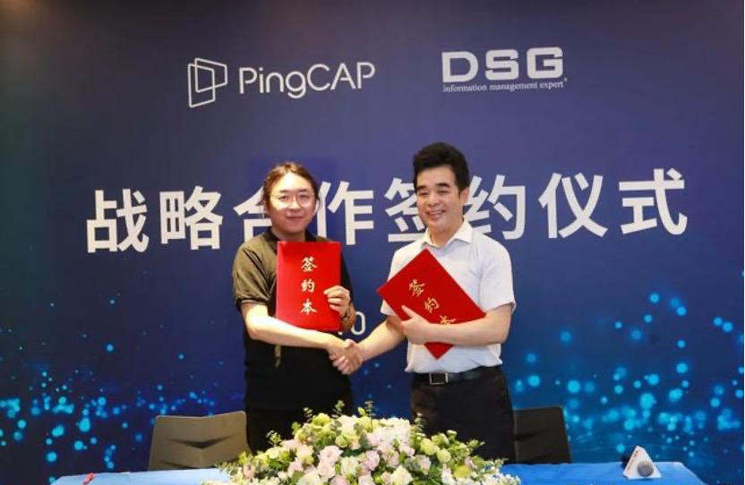
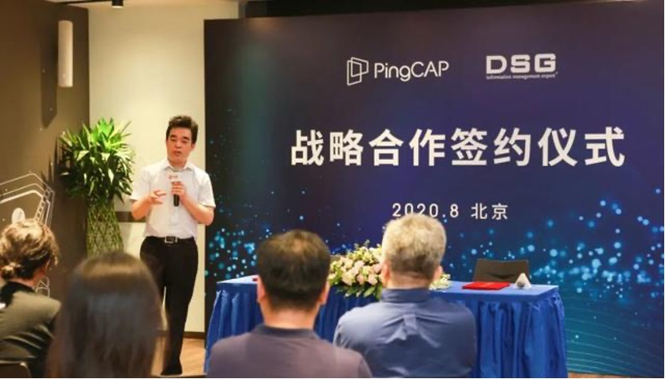

2020 年 8 月 12 日，平凯星辰（北京）科技有限公司（以下简称平凯星辰）与迪思杰（北京）数据管理技术有限公司（以下简称 DSG）正式签署战略合作协议，双方将在产品开发、渠道增值、客户资源、技术社区推广等多方面开展深度合作。 

  

图左：平凯星辰联合创始人、CTO 黄东旭；图右：DSG 创始人、总裁韩宏坤
  

平凯星辰是业界领先的开源 NewSQL 分布式 HTAP 数据库提供商，核心产品 TiDB 打破了关系型数据库与分布式数据库的壁垒，目前被全球近 1500 家不同行业的领先企业应用在实际生产环境。DSG 是中国信息系统安全与数据管理领域领先的公司，为用户提供优秀的数据管理软件和数据安全、灾难恢复、数据抽取共享、数据归档检索和一体化管理平台在内的解决方案，在国内运营商、金融、电力、公安、医疗领域的客户超过 1000 家。

**此次平凯星辰与 DSG 的合作，将发挥平凯星辰在全球数据库领域的技术优势与 DSG 在信息数据管理领域超过十年的专业积累，实现强强联合，进一步推动双方业务发展，扩大影响力**。DSG 将基于已有的 SuperSync 软件能力，支持 TiDB 的常用数据库复制需求，实现实时、异地远程、异构环境的热容灾等，助力 TiDB 产品在国内行业客户的数据生命周期管理的全过程。此外，TiDB 和 DSG 的异构数据迁移、多源数据同步解决方案分别能解决客户的部分数据库使用场景问题，也促进了双方在客户资源、渠道业务方面进行深度的合作，互相给对方产生增值影响。

   

平凯星辰联合创始人、CTO 黄东旭
  

平凯星辰联合创始人、CTO 黄东旭表示，作为一个数据库厂商，构建上下游异构产品生态是最重要的事情之一，而在构建生态的过程中，沟通不同生态的 ‘桥梁’ 型产品至关重要，DSG 正是这个领域的领先者，我相信让专业的人做专业的事情能够达到 1+1 大于二的效果。此次与 DSG 的战略签约合作不仅给彼此未来发展注入新的能量和空间，也将有助于为用户提供更多的产品选择、更好的体验和解决方案。  

 

DSG 创始人、总裁 韩宏坤

DSG 创始人、总裁韩宏坤表示，平凯星辰是一家技术领先的 NewSQL 分布式数据库技术厂商，DSG 公司是一家专注于数据库周围生态的技术和产品厂商，非常难得的是两家公司各自拥有全球领先公司的技术和产品，且高度互补。我们的合作是技术研发的合作，将实现全球各类商业版数据库、开源数据库与平凯星辰产品的无缝实时性对接，为国内外用户提供全面的、技术领先的数据库服务平台和数据中台等解决方案。我们合作还将面向国内，以及全球市场领域，期待一起共同开拓数据时代的未来！  

## 关于 DSG  

迪思杰（北京）数据管理技术有限公司（以下简称 DSG ），成立于 2006 年，拥有北京、成都、西安三个研发中心，在上海、广州等 25 个省市设有办事处。DSG 是全球领先的数据复制技术专业公司，拥有全球领先的数据库统一实时转换数据模型，拥有几乎所有国外主流数据库及各类国产数据库的实时日志分析复制技术和完全的自主知识产权，其数据库复制技术在处理 DML 和 DDL 的能力极强，能够快速、统一实现各类数据库之间的转换和异构目标端实时加载，能够简单快速实现对各类大数据组件的支持。同时，DSG 还拥有自主原创的数据库备份、交换、共享、脱敏、治理、监控和数据库救援产品以及技术完整的数据中台和大数据生态产品。上述各类产品线，已成功应用于政府部门、公安行业、银行、证券、保险、企业、医疗机构等 1000 多家客户业务环境。

## 关于平凯星辰  

平凯星辰（北京）科技有限公司成立于 2015 年，是一家开源的新型分布式数据库公司，秉承开源是基础软件的未来这一理念，平凯星辰持续扩大社区影响力，致力于前沿技术领域的创新实现。其研发的分布式关系型数据库 TiDB 项目，具备「分布式强一致性事务、在线弹性水平扩展、故障自恢复的高可用、跨数据中心多活」等核心特性，是大数据时代理想的数据库集群和云数据库解决方案。目前国内外已有近 1500 家用户将 TiDB 用于线上生产环境。
